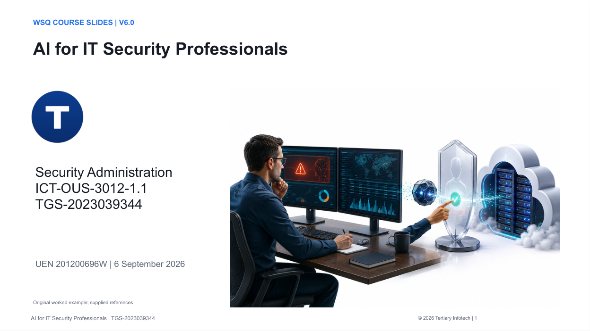

# AI for IT Security Professionals

**TGS-2023039344 · v6.0 · 6 September 2026**

  

A four-day course in evidence-based security administration, Azure controls and AI-assisted security operations from Tertiary Infotech Academy Pte Ltd.



## Course materials

The `courseware/` folder contains the editable PowerPoint, slide PDF, Learner Guide in DOCX/PDF/Markdown, and Lesson Plan in DOCX/PDF. The deck uses native editable charts and original illustrations. Detailed procedures are in the Learner Guide and lab instructions.

[Official course page](https://www.tertiarycourses.com.sg/wsq-ai-for-it-security-professionals.html) · [Course LMS](https://lms-tms.tertiaryinfotech.com/)

## Run a lab

Download this repository and keep the selected lab folder intact. Install Python 3.10 or later; the baseline requires no packages, credentials or network connection.

```bash
cd labs/lab-01-risk-register-and-patch-rollout
python3 analyse.py --input mock-data.json --output results.json
```

On Windows use `py -3` if needed. Open the lab's INSTRUCTIONS.md or INSTRUCTIONS.pdf, compare expected-results.json, change one input, and explain the result. Each folder has synthetic data, its own script, an AI review prompt, expected results and an evidence template.

The Python programs are deterministic teaching models, not trained AI models or full Azure emulators. The AI review exercise uses an organisation-approved tool separately. Azure procedures require the trainer-assigned sandbox, permissions and relevant feature entitlement. Report simulation, operational verification and blockers accurately.

## Learning plan

30 hours learning/practice plus 2 assessment hours. Days 1–3 have eight training hours each; Day 4 has six training hours and two assessment hours. Breaks are excluded.

- [Lab 01 risk register and patch rollout](labs/lab-01-risk-register-and-patch-rollout/INSTRUCTIONS.md)
- [Lab 02 redaction and ai evidence validation](labs/lab-02-redaction-and-ai-evidence-validation/INSTRUCTIONS.md)
- [Lab 03 rbac and privileged access](labs/lab-03-rbac-and-privileged-access/INSTRUCTIONS.md)
- [Lab 04 conditional access and workload identity](labs/lab-04-conditional-access-and-workload-identity/INSTRUCTIONS.md)
- [Lab 05 nsg segmentation and flow diagnosis](labs/lab-05-nsg-segmentation-and-flow-diagnosis/INSTRUCTIONS.md)
- [Lab 06 web edge and private access](labs/lab-06-web-edge-and-private-access/INSTRUCTIONS.md)
- [Lab 07 vm administration and encryption](labs/lab-07-vm-administration-and-encryption/INSTRUCTIONS.md)
- [Lab 08 storage sql and secret protection](labs/lab-08-storage-sql-and-secret-protection/INSTRUCTIONS.md)
- [Lab 09 policy and security posture](labs/lab-09-policy-and-security-posture/INSTRUCTIONS.md)
- [Lab 10 security logs and detection metrics](labs/lab-10-security-logs-and-detection-metrics/INSTRUCTIONS.md)
- [Lab 11 access rights troubleshooting](labs/lab-11-access-rights-troubleshooting/INSTRUCTIONS.md)
- [Lab 12 unauthorized access investigation](labs/lab-12-unauthorized-access-investigation/INSTRUCTIONS.md)
- [Lab 13 prompt injection and retrieval boundaries](labs/lab-13-prompt-injection-and-retrieval-boundaries/INSTRUCTIONS.md)
- [Lab 14 tool gateway and response approvals](labs/lab-14-tool-gateway-and-response-approvals/INSTRUCTIONS.md)
- [Lab 15 ai security evaluation](labs/lab-15-ai-security-evaluation/INSTRUCTIONS.md)
- [Lab 16 incident response and service recovery](labs/lab-16-incident-response-and-service-recovery/INSTRUCTIONS.md)

## Structure

- `courseware/`: current v6.0 learner and trainer deliverables.
- `labs/lab-01-.../` through `labs/lab-16-.../`: independent exercises.

Assessment papers and trainer answer keys are distributed through the authorised course process, not this public repository. Original ebooks, reference decks, credentials and build/QA tooling are excluded.

## Evidence and validation

All 16 baseline exercises and all 16 specified changed-input experiments were checked. The 413-slide deck and documents were rendered and visually reviewed. Native charts use explicitly synthetic lab data. These checks do not assert that Azure deployments were executed by the build process.

## Credits

Courseware by Tertiary Infotech Academy Pte Ltd, UEN 201200696W. Original illustrations generated for this course. Technical source references appear in the Learner Guide. Copyright 2026 Tertiary Infotech Academy Pte Ltd.
