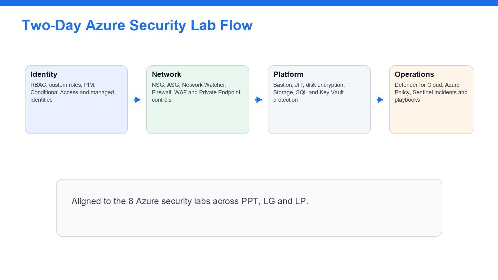
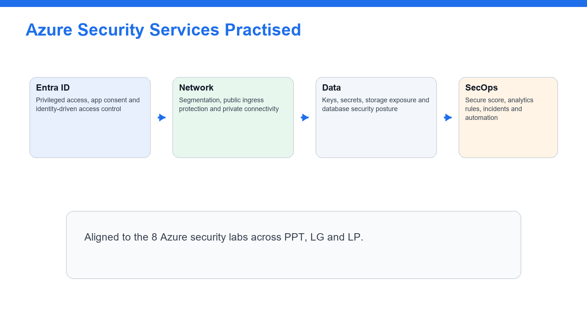
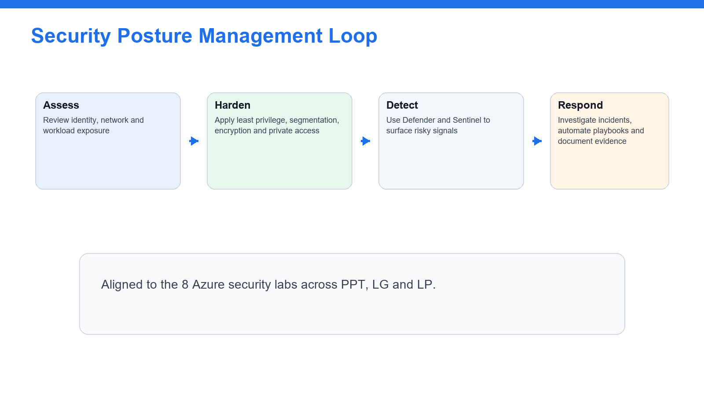

# Learner Guide - Microsoft Azure Security Engineer Associate (AZ-500)

**Course Code:** TGS-2023039344
**Organisation:** Tertiary Infotech Academy Pte Ltd (UEN: 201200696W)
**Version:** 5

This Markdown guide mirrors the Learner Guide DOCX and is generated from the same 8 lab markdown files.

## Course Diagrams







## Lab Alignment Matrix

| Lab | AZ-500 Domain | Title | Source |
| --- | --- | --- | --- |
| 1 | Domain 1 - Secure identity and access | Configure RBAC, Custom Roles, and Privileged Access Review | labs/lab-01-identity-rbac-pim.md |
| 2 | Domain 1 - Secure identity and access | Secure App Access with Conditional Access and Managed Identities | labs/lab-02-conditional-access-managed-identities.md |
| 3 | Domain 2 - Secure networking | Secure Virtual Networks with NSGs, ASGs, Peering, and Network Watcher | labs/lab-03-network-security-nsg-asg.md |
| 4 | Domain 2 - Secure networking | Protect Public and Private Access with Azure Firewall, WAF, and Private Endpoints | labs/lab-04-firewall-waf-private-endpoints.md |
| 5 | Domain 3 - Secure compute, storage, and databases | Secure Virtual Machines, Bastion, JIT Access, and Disk Encryption | labs/lab-05-compute-security-vm-bastion-jit.md |
| 6 | Domain 3 - Secure compute, storage, and databases | Protect Storage, SQL Database, and Key Vault Secrets | labs/lab-06-storage-sql-key-vault.md |
| 7 | Domain 4 - Manage security operations | Manage Security Posture with Azure Policy and Defender for Cloud | labs/lab-07-defender-policy-secure-score.md |
| 8 | Domain 4 - Manage security operations | Monitor, Investigate, and Automate with Microsoft Sentinel | labs/lab-08-sentinel-monitor-investigate-automate.md |


# Lab 1 - Configure RBAC, Custom Roles, and Privileged Access Review

**Day:** Day 1  
**Domain:** Domain 1 - Secure identity and access  
**Source:** `labs/lab-01-identity-rbac-pim.md`

## Lab 1 - Configure RBAC, Custom Roles, and Privileged Access Review

In this lab you will configure Azure role-based access control, create a scoped custom role, and review privileged access patterns with Microsoft Entra Privileged Identity Management.

---

## Step 1 - Create the training resource group

1. Open the Azure portal.
2. Search for **Resource groups**.
3. Select **Create**.
4. Name the resource group `rg-az500-<initials>`.
5. Choose the region assigned by your instructor.
6. Select **Review + create**, then **Create**.

Checkpoint: the resource group exists and is empty.

---

## Step 2 - Review inherited access

1. Open `rg-az500-<initials>`.
2. Select **Access control (IAM)**.
3. Select **View my access**.
4. Record your role assignments.
5. Open **Role assignments**.
6. Filter by your user account.

Checkpoint: you can identify whether your access is direct, group-based, or inherited from subscription scope.

---

## Step 3 - Assign a built-in role

1. In **Access control (IAM)**, select **Add role assignment**.
2. Choose **Reader**.
3. Select a classmate or instructor-provided test user.
4. Assign the role at the resource group scope.
5. Open **Role assignments** and confirm the assignment appears.

Checkpoint: the test user has read-only access to the training resource group.

---

## Step 4 - Create a custom role definition

1. In **Access control (IAM)**, select **Roles**.
2. Select **Create custom role**.
3. Name it `AZ500 Storage Key Reader <initials>`.
4. Start from scratch.
5. Add this permission:

```text
Microsoft.Storage/storageAccounts/listKeys/action
```

6. Set assignable scope to your training resource group.
7. Create the role.

Checkpoint: the custom role appears in the role list.

---

## Step 5 - Review privileged identity management

1. Search for **Microsoft Entra Privileged Identity Management**.
2. Open **Azure resources**.
3. Find your subscription or resource group if available.
4. Review eligible and active assignments.
5. If allowed, configure an eligible assignment for the Reader role.
6. Set activation to require justification.

If PIM is unavailable, record: `PIM requires Microsoft Entra ID P2 and sufficient role administration permissions.`

---

## What you learned

- How Azure RBAC scopes permissions.
- How built-in and custom roles differ.
- How PIM reduces standing privilege.
- How to document missing identity licensing or permissions during security reviews.


# Lab 2 - Secure App Access with Conditional Access and Managed Identities

**Day:** Day 1  
**Domain:** Domain 1 - Secure identity and access  
**Source:** `labs/lab-02-conditional-access-managed-identities.md`

## Lab 2 - Secure App Access with Conditional Access and Managed Identities

In this lab you will review Conditional Access, app registrations, service principals, OAuth consent, and managed identities. These controls are central to secure identity and application access in Azure.

---

## Step 1 - Review Conditional Access policies

1. Open **Microsoft Entra admin center**.
2. Go to **Protection** > **Conditional Access**.
3. Open **Policies**.
4. Review any existing policies.
5. Create a report-only policy named `AZ500 Require MFA for Azure Portal <initials>`.
6. Set **Users** to your test group or your own account.
7. Set **Target resources** to **Microsoft Azure Management**.
8. Set **Grant** to **Require multifactor authentication**.
9. Set policy mode to **Report-only**.
10. Save the policy.

Checkpoint: the policy exists but does not enforce access yet.

---

## Step 2 - Review sign-in impact

1. Open **Sign-in logs**.
2. Filter to your account.
3. Open a recent Azure portal sign-in.
4. Review the Conditional Access tab.
5. Confirm whether the report-only policy would have applied.

Checkpoint: you can assess policy impact before enforcement.

---

## Step 3 - Create an app registration

1. Go to **Microsoft Entra ID** > **App registrations**.
2. Select **New registration**.
3. Name it `app-az500-<initials>`.
4. Use single tenant access.
5. Register the app.
6. Record the Application client ID and Directory tenant ID.

Checkpoint: the app registration exists.

---

## Step 4 - Review API permissions and consent

1. Open the app registration.
2. Select **API permissions**.
3. Add a delegated Microsoft Graph permission such as `User.Read`.
4. Review whether admin consent is required.
5. Do not grant admin consent unless instructed.

Checkpoint: you can explain delegated permissions, application permissions, and admin consent.

---

## Step 5 - Enable a managed identity

1. Create or open a training virtual machine, automation account, or app service.
2. Open **Identity**.
3. Turn **System assigned** identity **On**.
4. Save.
5. Return to the resource group IAM page.
6. Assign the managed identity the **Reader** role on the resource group.

Checkpoint: an Azure resource has an identity that can be assigned RBAC permissions without storing credentials.

---

## What you learned

- How report-only Conditional Access protects against accidental lockout.
- How app registrations expose API permissions and consent decisions.
- How managed identities replace application secrets.
- How service principals connect applications to Azure RBAC.


# Lab 3 - Secure Virtual Networks with NSGs, ASGs, Peering, and Network Watcher

**Day:** Day 1  
**Domain:** Domain 2 - Secure networking  
**Source:** `labs/lab-03-network-security-nsg-asg.md`

## Lab 3 - Secure Virtual Networks with NSGs, ASGs, Peering, and Network Watcher

In this lab you will create a segmented virtual network, apply Network Security Groups, use Application Security Groups, and validate traffic using Network Watcher.

---

## Step 1 - Create a virtual network

1. Create a virtual network named `vnet-az500-<initials>`.
2. Use address space `10.50.0.0/16`.
3. Create subnets:
   - `snet-web` - `10.50.1.0/24`
   - `snet-app` - `10.50.2.0/24`
   - `snet-data` - `10.50.3.0/24`
4. Place it in `rg-az500-<initials>`.

Checkpoint: the VNet has three subnets.

---

## Step 2 - Create application security groups

1. Create ASG `asg-web-<initials>`.
2. Create ASG `asg-app-<initials>`.
3. Create ASG `asg-data-<initials>`.

Checkpoint: ASGs exist in the same region as the VNet.

---

## Step 3 - Create network security groups

1. Create NSG `nsg-web-<initials>`.
2. Allow inbound HTTPS from Internet to web tier:
   - Source: `Internet`
   - Destination: `asg-web-<initials>`
   - Destination port: `443`
   - Protocol: TCP
   - Action: Allow
3. Create NSG `nsg-app-<initials>`.
4. Allow inbound app traffic only from `asg-web-<initials>` to `asg-app-<initials>`.
5. Create NSG `nsg-data-<initials>`.
6. Allow database traffic only from `asg-app-<initials>` to `asg-data-<initials>`.

Checkpoint: rules describe tier-to-tier intent instead of broad IP access.

---

## Step 4 - Associate NSGs to subnets

1. Associate `nsg-web-<initials>` to `snet-web`.
2. Associate `nsg-app-<initials>` to `snet-app`.
3. Associate `nsg-data-<initials>` to `snet-data`.

Checkpoint: each subnet has a specific NSG.

---

## Step 5 - Use Network Watcher IP flow verify

1. Open **Network Watcher**.
2. Select **IP flow verify**.
3. Choose a VM NIC if your instructor provided one, or review the input fields if no VM exists.
4. Test allowed and denied flows.
5. Record which NSG rule allows or denies each flow.

Checkpoint: you can use Network Watcher to explain why traffic is allowed or blocked.

---

## What you learned

- How NSGs enforce subnet and NIC-level traffic rules.
- How ASGs make rules easier to manage.
- How Network Watcher validates network security behavior.
- Why least privilege network design uses explicit tier flows.


# Lab 4 - Protect Public and Private Access with Azure Firewall, WAF, and Private Endpoints

**Day:** Day 1  
**Domain:** Domain 2 - Secure networking  
**Source:** `labs/lab-04-firewall-waf-private-endpoints.md`

## Lab 4 - Protect Public and Private Access with Azure Firewall, WAF, and Private Endpoints

In this lab you will design public and private access protections using Azure Firewall, Web Application Firewall concepts, and Private Endpoints. Some resources can be reviewed instead of deployed if your training subscription has quota or cost limits.

---

## Step 1 - Plan firewall placement

1. Open the VNet from Lab 3.
2. Add subnet `AzureFirewallSubnet` with address range `10.50.10.0/26`.
3. Review the Azure Firewall creation wizard.
4. Name the firewall `afw-az500-<initials>`.
5. If your instructor allows deployment, create it with a firewall policy.
6. If not deploying, document the required subnet, public IP, and policy components.

Checkpoint: you can describe where Azure Firewall sits in a hub-spoke network.

---

## Step 2 - Review firewall policy rules

1. Open the firewall policy.
2. Create a rule collection group named `rcg-az500-training`.
3. Add an application rule allowing outbound HTTPS to `learn.microsoft.com`.
4. Add a network rule allowing DNS to your approved DNS server.
5. Review threat intelligence mode.

Checkpoint: you can distinguish application rules from network rules.

---

## Step 3 - Review WAF protection

1. Search for **Application Gateway**.
2. Review the creation workflow.
3. Select WAF v2 tier in the review steps if deployment is allowed.
4. Open **Web application firewall policies**.
5. Review managed OWASP rule sets.
6. Create a policy named `waf-az500-<initials>` if permitted.
7. Leave prevention mode disabled unless instructed.

Checkpoint: you can explain how WAF protects HTTP applications differently from Azure Firewall.

---

## Step 4 - Create a storage account private endpoint

1. Create a storage account named `staz500<initials>001`.
2. Disable public blob access.
3. Open **Networking**.
4. Choose **Private endpoint connections**.
5. Create a private endpoint for the Blob service.
6. Place it in `snet-data`.
7. Enable private DNS zone integration if available.

Checkpoint: the storage account can be reached privately from the VNet.

---

## Step 5 - Review public access settings

1. Return to the storage account networking page.
2. Set public network access to disabled or selected networks, depending on class constraints.
3. Review firewall and virtual network rules.
4. Record why private endpoints reduce public exposure.

---

## What you learned

- When to use Azure Firewall, WAF, and Private Endpoints.
- How firewall policies organize network and application rules.
- How private access reduces public attack surface.
- How to document cost-sensitive security resources without deploying every component.


# Lab 5 - Secure Virtual Machines, Bastion, JIT Access, and Disk Encryption

**Day:** Day 2  
**Domain:** Domain 3 - Secure compute, storage, and databases  
**Source:** `labs/lab-05-compute-security-vm-bastion-jit.md`

## Lab 5 - Secure Virtual Machines, Bastion, JIT Access, and Disk Encryption

In this lab you will secure administrative access to virtual machines and review compute hardening options such as Bastion, Just-in-Time access, and disk encryption.

---

## Step 1 - Create a test virtual machine

1. Create a Windows or Linux VM named `vm-az500-<initials>`.
2. Place it in `rg-az500-<initials>`.
3. Use `snet-app` from Lab 3.
4. Do not expose RDP or SSH directly to the Internet unless your instructor explicitly permits it.
5. Use a small VM size approved by the instructor.

Checkpoint: the VM exists in the app subnet.

---

## Step 2 - Deploy or review Azure Bastion

1. Add subnet `AzureBastionSubnet` with address range `10.50.20.0/26`.
2. Search for **Bastions**.
3. Create Bastion `bas-az500-<initials>` if class budget allows.
4. If Bastion is not deployed, review the required subnet, public IP, and connection flow.

Checkpoint: you can explain how Bastion avoids public management ports on VMs.

---

## Step 3 - Remove public management exposure

1. Open the VM networking blade.
2. Review inbound port rules.
3. Remove any direct inbound RDP or SSH rule from Internet.
4. Confirm NSG rules do not allow broad management access.

Checkpoint: management access is not exposed directly to the Internet.

---

## Step 4 - Configure Just-in-Time VM access

1. Open **Microsoft Defender for Cloud**.
2. Select **Workload protections**.
3. Open **Just-in-time VM access**.
4. Add the VM if Defender plan permissions allow it.
5. Configure allowed ports and approved source IP ranges.

If JIT is unavailable, record: `JIT requires Defender for Servers and sufficient Defender for Cloud permissions.`

---

## Step 5 - Review disk encryption options

1. Open the VM **Disks** blade.
2. Review encryption settings.
3. Identify platform-managed keys and customer-managed key options.
4. Review encryption at host if available.
5. Record which controls would be required for a high-security workload.

---

## What you learned

- How Bastion reduces VM management exposure.
- How JIT limits management ports to approved time windows.
- How NSGs, Defender for Cloud, and encryption combine for VM security.
- How to choose between platform-managed and customer-managed encryption.


# Lab 6 - Protect Storage, SQL Database, and Key Vault Secrets

**Day:** Day 2  
**Domain:** Domain 3 - Secure compute, storage, and databases  
**Source:** `labs/lab-06-storage-sql-key-vault.md`

## Lab 6 - Protect Storage, SQL Database, and Key Vault Secrets

In this lab you will configure security controls for Azure Storage, Azure SQL Database, and Azure Key Vault.

---

## Step 1 - Harden storage account access

1. Open the storage account from Lab 4.
2. Go to **Configuration**.
3. Require secure transfer.
4. Disable blob anonymous access.
5. Review minimum TLS version.
6. Go to **Data protection**.
7. Enable soft delete for blobs.
8. Enable versioning if available.

Checkpoint: storage data protection settings are enabled.

---

## Step 2 - Review storage keys and shared access

1. Open **Access keys**.
2. Review key rotation options.
3. Do not copy keys into lab notes.
4. Open **Shared access signature**.
5. Review how SAS scope and expiry reduce risk.
6. Do not generate a broad account SAS unless instructed.

Checkpoint: you can explain why identity-based access is preferred over long-lived keys.

---

## Step 3 - Create a Key Vault

1. Create Key Vault `kv-az500-<initials>-001`.
2. Use Azure RBAC permission model if instructed.
3. Enable purge protection if allowed.
4. Enable soft delete.
5. Open **Networking** and review public access options.

Checkpoint: Key Vault has recovery protections enabled.

---

## Step 4 - Add and protect a secret

1. Open **Secrets**.
2. Create a secret named `training-api-key`.
3. Use a dummy value such as `not-a-real-secret`.
4. Set an expiration date.
5. Review secret version history.

Checkpoint: secret lifecycle and expiry are visible.

---

## Step 5 - Create or review Azure SQL Database security

1. Create a small Azure SQL Database if class budget allows, or review an instructor-provided database.
2. Enable Microsoft Entra authentication if available.
3. Open **Auditing** and enable audit logs to a storage account or Log Analytics workspace.
4. Review **Dynamic data masking**.
5. Review **Transparent Data Encryption**.
6. Review **Always Encrypted** documentation from the SQL security blade.

Checkpoint: you can identify SQL controls for authentication, auditing, masking, and encryption.

---

## What you learned

- How to harden storage access and recovery settings.
- How Key Vault protects keys, secrets, and certificates.
- How Azure SQL Database security features map to confidentiality and audit requirements.
- Why secret values should not be copied into lab submissions.


# Lab 7 - Manage Security Posture with Azure Policy and Defender for Cloud

**Day:** Day 2  
**Domain:** Domain 4 - Manage security operations  
**Source:** `labs/lab-07-defender-policy-secure-score.md`

## Lab 7 - Manage Security Posture with Azure Policy and Defender for Cloud

In this lab you will use Azure Policy and Microsoft Defender for Cloud to assess compliance, secure score, and recommended remediation actions.

---

## Step 1 - Assign an Azure Policy

1. Search for **Policy**.
2. Select **Definitions**.
3. Find a built-in policy such as **Storage accounts should prevent shared key access** or **Secure transfer to storage accounts should be enabled**.
4. Assign it to `rg-az500-<initials>`.
5. Name the assignment `az500-storage-security-<initials>`.
6. Create the assignment.

Checkpoint: a security policy is assigned to the training scope.

---

## Step 2 - Review compliance

1. Open **Policy** > **Compliance**.
2. Find your policy assignment.
3. Review compliant and non-compliant resources.
4. Open a non-compliant resource if one exists.
5. Identify the remediation action.

Checkpoint: you can interpret policy compliance results.

---

## Step 3 - Open Defender for Cloud

1. Search for **Microsoft Defender for Cloud**.
2. Open **Overview**.
3. Review secure score.
4. Open **Recommendations**.
5. Filter by your resource group or subscription if possible.

Checkpoint: you can find security recommendations and affected resources.

---

## Step 4 - Review regulatory compliance

1. Open **Regulatory compliance**.
2. Review available standards.
3. Open Microsoft Cloud Security Benchmark if available.
4. Identify failed controls and affected resources.

Checkpoint: you can connect policy findings to compliance frameworks.

---

## Step 5 - Review Defender plans

1. Open **Environment settings**.
2. Select the subscription.
3. Review Defender plans for Servers, Storage, SQL, Containers, and other workloads.
4. Do not enable paid plans unless your instructor approves.

Checkpoint: you can explain how workload protection plans affect alerting and recommendations.

---

## What you learned

- How Azure Policy enforces governance.
- How Defender for Cloud calculates secure score.
- How recommendations support remediation.
- How compliance standards map technical controls to frameworks.


# Lab 8 - Monitor, Investigate, and Automate with Microsoft Sentinel

**Day:** Day 2  
**Domain:** Domain 4 - Manage security operations  
**Source:** `labs/lab-08-sentinel-monitor-investigate-automate.md`

## Lab 8 - Monitor, Investigate, and Automate with Microsoft Sentinel

In this lab you will configure a Microsoft Sentinel workspace, connect data, run KQL queries, create an analytics rule, and review automation options.

---

## Step 1 - Create a Log Analytics workspace

1. Search for **Log Analytics workspaces**.
2. Create `law-az500-<initials>`.
3. Place it in `rg-az500-<initials>`.
4. Choose the instructor-approved region.

Checkpoint: the Log Analytics workspace exists.

---

## Step 2 - Enable Microsoft Sentinel

1. Search for **Microsoft Sentinel**.
2. Select **Create**.
3. Choose `law-az500-<initials>`.
4. Add Sentinel to the workspace.

Checkpoint: the workspace is now a Sentinel workspace.

---

## Step 3 - Connect Azure activity data

1. Open **Content hub** or **Data connectors**.
2. Find **Azure Activity**.
3. Open the connector page.
4. Connect subscription activity logs if permitted.
5. If connection is blocked, record the required permission.

Checkpoint: Sentinel has at least one planned or active data source.

---

## Step 4 - Run basic KQL queries

1. Open **Logs**.
2. Run:

```kusto
AzureActivity
| take 10
```

3. Run:

```kusto
AzureActivity
| summarize Events=count() by OperationNameValue
| order by Events desc
```

If no data exists yet, run the queries later or use the sample query view.

Checkpoint: you can use KQL to explore security telemetry.

---

## Step 5 - Create an analytics rule

1. Open **Analytics**.
2. Select **Create** > **Scheduled query rule**.
3. Name it `AZ500 Suspicious Resource Changes <initials>`.
4. Use a query based on AzureActivity.
5. Set severity to Medium.
6. Configure entity mapping if available.
7. Set the rule to create incidents.
8. Save the rule.

Checkpoint: Sentinel can convert suspicious activity into incidents.

---

## Step 6 - Review automation

1. Open **Automation**.
2. Review automation rules.
3. Review playbook creation options.
4. If allowed, create a simple automation rule that tags incidents from your lab rule.
5. Do not create external notification or remediation playbooks unless instructed.

Checkpoint: you can explain how Sentinel automation supports incident response.

---

## What you learned

- How Sentinel uses Log Analytics workspaces.
- How data connectors bring telemetry into the SIEM.
- How KQL supports investigation.
- How analytics rules and automation support alerting and response.

